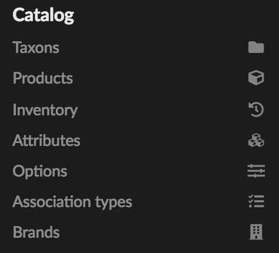
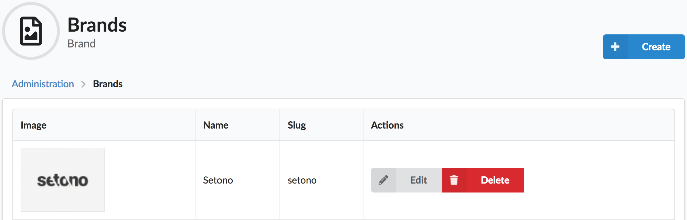
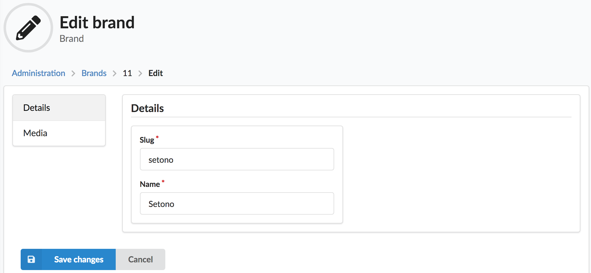
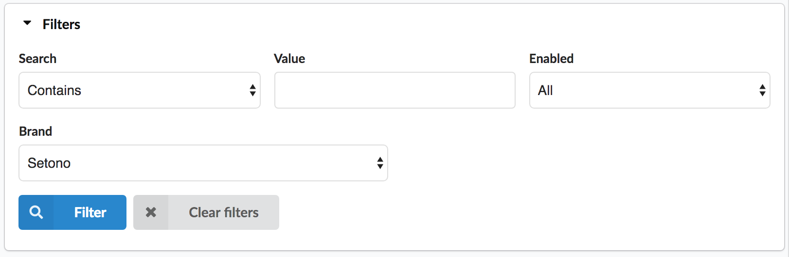
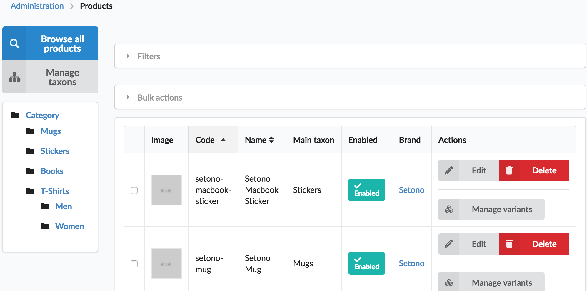
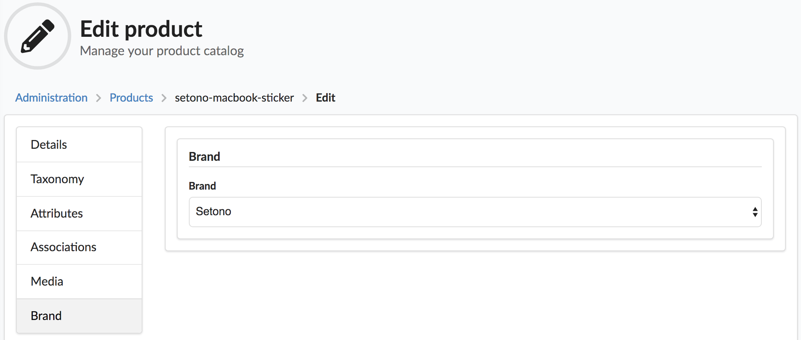

# Sylius Brand Plugin

[![Latest Version on Packagist][ico-version]][link-packagist]
[![Software License][ico-license]](LICENSE)
[![Build Status][ico-travis]][link-travis]
[![Quality Score][ico-code-quality]][link-code-quality]

<a href="https://sylius.com/plugins/" target="_blank"></a>

If you want to add a brand to your products this is the plugin to use. Use cases:
- Add brand logo to your product pages
- Filter by brand in the frontend or backend, i.e. product lists

## Screenshots

Menu:



Brand admin pages:





Products admin pages:







## Installation

### Step 1: Download the plugin

Open a command console, enter your project directory and execute the following command to download the latest stable version of this bundle:

```bash
$ composer require loevgaard/sylius-brand-plugin
```

This command requires you to have Composer installed globally, as explained in the [installation chapter](https://getcomposer.org/doc/00-intro.md) of the Composer documentation.


### Step 2: Enable the plugin

Then, enable the plugin by adding it to the list of registered plugins/bundles
in `config/bundles.php` file of your project:

```php
<?php

return [
    // ...
    Loevgaard\SyliusBrandPlugin\LoevgaardSyliusBrandPlugin::class => ['all' => true],
    // ...
];
```

### Step 3: Configure the plugin

```yaml
# config/packages/loevgaard_sylius_brand.yaml

imports:
    # ...
    - { resource: "@LoevgaardSyliusBrandPlugin/Resources/config/config.yml" }

    # If you want to see Brand column at admin products list - uncomment next line
    # - { resource: "@LoevgaardSyliusBrandPlugin/Resources/config/grids/sylius_admin_product.yml" }
```

```yaml
# config/routes/loevgaard_sylius_brand.yaml

loevgaard_sylius_brand:
    resource: "@LoevgaardSyliusBrandPlugin/Resources/config/routing.yml"
```

### Step 4: Extends entities

#### Extend `Product` 

```php
<?php
// src/Entity/Product.php

declare(strict_types=1);

namespace App\Entity;

use Doctrine\ORM\Mapping as ORM;
use Loevgaard\SyliusBrandPlugin\Entity\ProductTrait;
use Loevgaard\SyliusBrandPlugin\Entity\ProductInterface as LoevgaardSyliusBrandPluginProductInterface;
use Sylius\Component\Core\Model\Product as BaseProduct;

/**
 * @ORM\MappedSuperclass()
 * @ORM\Table(name="sylius_product")
 */
class Product extends BaseProduct implements LoevgaardSyliusBrandPluginProductInterface
{
    use ProductTrait;
    
    // ...
}
```

**NOTE:** If you haven't extended the `Product` entity yet, follow the [customization instructions](https://docs.sylius.com/en/1.3/customization/model.html) first because you need to add a bit more configuration.

#### Extend `ProductRepository`

```php
<?php
# Doctrine/ORM/ProductRepository.php

declare(strict_types=1);

namespace App\Doctrine\ORM;

use Loevgaard\SyliusBrandPlugin\Doctrine\ORM\ProductRepositoryInterface;
use Loevgaard\SyliusBrandPlugin\Doctrine\ORM\ProductRepositoryTrait;
use Sylius\Bundle\CoreBundle\Doctrine\ORM\ProductRepository as BaseProductRepository;

class ProductRepository extends BaseProductRepository implements ProductRepositoryInterface
{
    use ProductRepositoryTrait;

    // ...
}
```

#### Configure

```yaml
config/sylius_product.yml

sylius_product:
    resources:
        product:
            classes:
                model: App\Entity\Product
                repository: App\Doctrine\ORM\ProductRepository

```  

### Step 5: Update your database schema

```bash
$ php bin/console doctrine:migrations:diff
$ php bin/console doctrine:migrations:migrate
```

or use [Doctrine Migrations](https://symfony.com/doc/master/bundles/DoctrineMigrationsBundle/index.html).

## Fixtures

 1. Add a new yaml file to the folder `config/packages` and name it as you wish, e.g. `my_own_fixtures.yaml`.

 2. Fill this yaml with your own brand fixtures and don't forget to declare the definition of
   your product(s) before this brand definition or use existing product(s) code.
    ```
    # config/packages/my_own_fixtures.yaml
    
    sylius_fixtures:
       suites:
           my_own_brand_fixtures:
                fixtures:
                    loevgaard_sylius_brand_plugin_brand:
                        options:
                            custom:
                                flux:
                                    name: 'My brand'
                                    slug: 'my-brand'
                                    images:
                                      - type: logo
                                        path: logos/my-brand.jpg
                                    products:
                                      - product_code_1
                                      - product_code_2
                                      - product_code_3
    ```

    See example at `tests/Application/config/packages/sylius_fixtures.yml`.

 3. Load your fixtures

    ```bash
    php bin/console sylius:fixture:load my_own_brand_fixtures
    ```

## Installation and usage for plugin development

To run test application to play with just type `composer try`.

### Sonata blocks available

* `loevgaard_sylius_brand.admin.brand.create.tab_details`
* `loevgaard_sylius_brand.admin.brand.update.tab_details`
* `loevgaard_sylius_brand.admin.brand.create.tab_media`
* `loevgaard_sylius_brand.admin.brand.update.tab_media`

### Events available

* `loevgaard_sylius_brand.menu.admin.brand.form` to customize `Brand` 
  admin form like you usually do with `Product` form via
  `sylius.menu.admin.product.form` event.

## Testing

### Play with API

* Install https://stedolan.github.io/jq/
  (type `brew install jq` at OSX terminal)

* Get admin API access token:

    ```bash
    SYLIUS_ADMIN_API_ACCESS_TOKEN=$(curl http://localhost:8000/api/oauth/v2/token \
        --silent --show-error \
        -d "client_id"=demo_client \
        -d "client_secret"=secret_demo_client \
        -d "grant_type"=password \
        -d "username"=api@example.com \
        -d "password"=sylius-api | jq '.access_token' --raw-output)
    ```

* Make requests:

   (`GET` requests indexing/showing resources shown here, 
   see `tests/Controller/*ApiTest.php` to discover more details
   about how to communicate with API and create `BrandImages` 
   with actual files)

   To Brands admin API:

    ```bash
    curl http://localhost:8000/api/v1/brands/ \
        -H "Authorization: Bearer $SYLIUS_ADMIN_API_ACCESS_TOKEN"
    ```

    ```bash
    curl http://localhost:8000/api/v1/brands/setono/ \
        -H "Authorization: Bearer $SYLIUS_ADMIN_API_ACCESS_TOKEN"
    ```

    Brand images API:

    ```bash
    curl http://localhost:8000/api/v1/brands/setono/images/ \
        -H "Authorization: Bearer $SYLIUS_ADMIN_API_ACCESS_TOKEN"
    ```

    Brand images by type API:

    ```bash
    curl http://localhost:8000/api/v1/brands/setono/images/logo/ \
        -H "Authorization: Bearer $SYLIUS_ADMIN_API_ACCESS_TOKEN"
    ```

    ```bash
    curl http://localhost:8000/api/v1/brands/setono/images/<ID>/ \
        -H "Authorization: Bearer $SYLIUS_ADMIN_API_ACCESS_TOKEN"
    ```

    Brand products API:

    ```bash
    curl http://localhost:8000/api/v1/brands/setono/products/ \
        -H "Authorization: Bearer $SYLIUS_ADMIN_API_ACCESS_TOKEN"
    ```

    Product details API:

    ```bash
    curl http://localhost:8000/api/v1/products/setono-mug/ \
        -H "Authorization: Bearer $SYLIUS_ADMIN_API_ACCESS_TOKEN"
    ```

    For XML output, add `-H "Accept: application/xml"` to request

## Contribute

Please, run `composer all` to run all checks and tests before committing.

### Contribute by translating

We use the same service as Sylius for translating, namely [Crowdin](https://crowdin.com/project/sylius-brand-plugin). You can help out by translating this project into your mother tongue ;)

Thanks!

[ico-version]: https://img.shields.io/packagist/v/loevgaard/sylius-brand-plugin.svg?style=flat-square
[ico-license]: https://img.shields.io/badge/license-MIT-brightgreen.svg?style=flat-square
[ico-travis]: https://img.shields.io/travis/loevgaard/SyliusBrandPlugin/master.svg?style=flat-square
[ico-code-quality]: https://img.shields.io/scrutinizer/g/loevgaard/SyliusBrandPlugin.svg?style=flat-square

[link-packagist]: https://packagist.org/packages/loevgaard/sylius-brand-plugin
[link-travis]: https://travis-ci.org/loevgaard/SyliusBrandPlugin
[link-code-quality]: https://scrutinizer-ci.com/g/loevgaard/SyliusBrandPlugin
